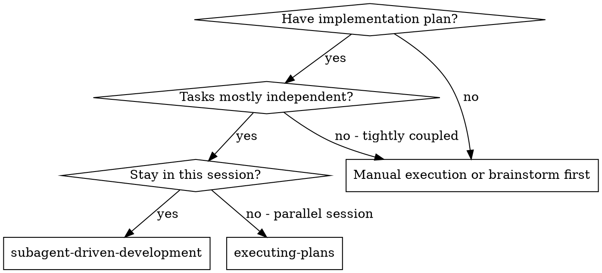
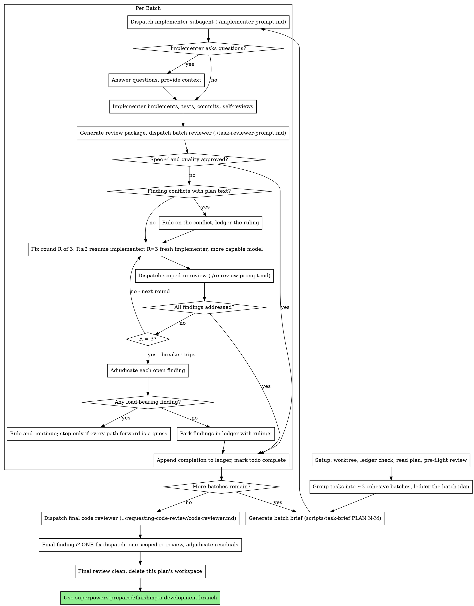

# Subagent-Driven Development

Execute plan by grouping its tasks into a few cohesive batches, dispatching a fresh implementer subagent per batch, a review (spec compliance + code quality) after each, strict review gates and a broad whole-branch review at the end.

## Required Start

Announce: `I'm using subagent-driven-development to execute this plan.`

**Why subagents:** You delegate tasks to specialized agents with isolated context. By precisely crafting their instructions and context, you ensure they stay focused and succeed at their task. They should never inherit your session's context or history — you construct exactly what they need. This also preserves your own context for coordination work.

**Core principle:** Fresh subagent per cohesive *batch* of tasks + review per batch (spec + quality) + broad final review = high quality, fast iteration

The unit of dispatch is the batch, never the individual task — see Batching. One subagent per task is measurably the slowest, costliest, and lowest-quality way to run a plan.

**Narration:** between tool calls, narrate at most one short line — the
ledger and the tool results carry the record.

**Continuous execution:** Do not pause to check in with your human partner between tasks. Execute all tasks from the plan without stopping. The only reasons to stop are the four named below, or all tasks complete. "Should I continue?" prompts and progress summaries waste their time — they asked you to execute the plan, so execute it.

**Rulings, not stalls.** A running plan does not wait on a human. Conflicts,
ambiguities, plan defects, a cap you would have asked to exceed — decide
them. The spec is the binding authority, the plan is its argument, and your
judgment settles what neither answers. Record every decision in the ledger as
`Ruling: <what you decided> — <why> — <what it costs if wrong>`, and keep
going. A wrong ruling costs rework your human partner can see and undo; a
session parked on a question costs their whole day and buys nothing.

Four things stop you, and only these: an irreversible or destructive
operation; a security-sensitive action; a side effect outside this worktree
that norms say you ask about first (a merge, a push to a shared branch, a
publish); and a plan so broken that every path forward is a guess. For those,
stop and ask.

## Core Flow



**vs. Executing Plans (parallel session):**
- Same session (no context switch)
- Fresh subagent per batch of tasks (no context pollution)
- Review after each batch (spec compliance + code quality), broad review at the end
- Faster iteration (no human-in-loop between tasks)

## The Process



## Setup

Ensure the work happens in an isolated workspace: use
superpowers-prepared:using-git-worktrees to create one or verify the existing one.
Never start implementation on a main/master branch without your human
partner's explicit consent.

Conversation memory does not survive compaction. In real sessions,
controllers that lost their place have re-dispatched entire completed task
sequences — the single most expensive failure observed. Track progress in
a ledger file, not only in todos.

- Each plan owns a workspace: at skill start, run this skill's
  `scripts/sdd-workspace PLAN_FILE` — it prints the plan's git-ignored
  directory (`<repo-root>/.superpowers/sdd/<plan-basename>/`), home to
  every artifact for THIS plan: ledger, briefs, reports, review packages.
  Another plan's directory is never yours to read or write.
- Check for this plan's ledger at `<workspace>/progress.md`. If its first
  line names your plan file, batches with a `Batch <B>: complete` line are
  DONE — do not re-dispatch them; resume at the first batch without one, and
  re-read the recorded batch plan rather than re-deriving the grouping. A
  batch whose last line is a fix round is mid-loop: resume the loop at the
  next round. A ledger whose first line names a different plan file — or a stray
  ledger at the old flat path `.superpowers/sdd/progress.md` — is another
  plan's progress: leave it in place and start your own, fresh.
- Create the ledger with its identity as the first line:
  `# SDD ledger — plan: <plan file path>`.
- The ledger is your recovery map: the commits it names exist in git even
  when your context no longer remembers creating them. After compaction,
  trust the ledger and `git log` over your own recollection.
- `git clean -fdx` will destroy the workspace (it's git-ignored scratch); if
  that happens, recover from `git log`.

Read the plan once and note its context and Global Constraints. Then group
its tasks into batches per the Batching section, write the batch plan to the
ledger, and create **one todo per batch** — not one per task. The todo
granularity is what keeps the ledger, the checkboxes, and the dispatches in
agreement; a todo per task with a dispatch per batch desynchronizes all
three. Track individual tasks as the plan's own checkboxes, which you tick
as each batch reports.

If the plan names a Spec, read that too: the spec is the
authority the plan argues from, and conflicts inside the plan resolve
against it. A plan with no reachable spec gets a ledger note saying so —
rulings made without one are provisional.

## Use the project harness

For the subagents you dispatch, use the project harness to provide context and structure their work. The harness gives you access to project files, patterns, and the spec parser, which you can use to construct precise prompts that guide the subagents effectively.
For tasks centered on frontend/UI, apply `frontend-design standards` skill (if available) to guide structure, styling, and accessibility.
For tasks involving React/Next.js code, apply `vercel-react-best-practices` or any other available skills (of the current frontend framework) for performance optimization, data fetching patterns, and bundle size.
For tasks involving new libs, specific versions or technologies, use `context7` (if available) to check for updated lib or technology information or how-tos.

## Pre-Flight Plan Review

Before dispatching Task 1, scan the plan once for conflicts, writing down
what you checked as you check it:

- tasks that contradict each other or the plan's Global Constraints
- anything the plan explicitly mandates that the review rubric treats as a
  defect (a test that asserts nothing, verbatim duplication of a logic block)

The scan's output is a table, not a verdict. One row for every pair of tasks
that share a file or an interface: the two tasks, what one produces against
what the other consumes, and what you found. One row for every task: whether
its own text agrees with itself — the tests it specifies against the code it
specifies, the files it creates against the files it later touches. "The scan
is clean" without those rows is not a scan you ran.

Write the table to the ledger. Rule on everything you find before execution
begins — each finding against the plan text that mandates it — and record
each ruling in the ledger. If the scan is clean, proceed without comment.
Rule on each conflict it surfaces — the spec is the binding authority, the
plan is its argument — record the ruling beside its row, and dispatch
Task 1. The review loop remains the net for conflicts that only emerge from
implementation.

## Model Selection

Use the least powerful model that can handle each role to conserve cost and increase speed.

**Mechanical implementation tasks** (isolated functions, clear specs, 1-2 files): use a fast, cheap model. Most implementation tasks are mechanical when the plan is well-specified.

**Integration and judgment tasks** (multi-file coordination, pattern matching, debugging): use a standard model.

**Architecture and design tasks**: use the most capable available model.
The final whole-branch review is one of these — dispatch it on the most
capable available model, not the session default.

**Review tasks**: choose the model with the same judgment, scaled to the
diff's size, complexity, and risk. A small mechanical diff does not need the
most capable model; a subtle concurrency change does. Scoped re-reviews of
small fix diffs take a cheap-to-mid tier.

**Fix-loop escalation (round 3)**: use a model at least one tier above
the implementer that got stuck.

**Always specify the model explicitly when dispatching a subagent.** An
omitted model inherits your session's model — often the most capable and
most expensive — which silently defeats this section.

**Turn count beats token price.** Wall-clock and context cost scale with how
many turns a subagent takes, and the cheapest models routinely take 2-3× the
turns on multi-step work — costing more overall. Use a mid-tier model as the
floor for reviewers and for implementers working from prose descriptions.
When the task's plan text contains the complete code to write, the
implementation is transcription plus testing: use the cheapest tier for
that implementer. Single-file mechanical fixes also take the cheapest tier.

**Task complexity signals (implementation tasks):**
- Touches 1-2 files with a complete spec → cheap model
- Touches multiple files with integration concerns → standard model
- Requires design judgment or broad codebase understanding → most capable model

## Harness Integration

Before dispatching any implementer subagent:

1. Invoke `extract-boundary` to gather minimal context for the batch's files, semantic understanding and project context. Scope it to the batch as a whole — the types and signatures its tasks share — not to each task separately; per-task extraction across a 6-task batch produces six overlapping envelopes and defeats the point.
2. Include in the implementer prompt: "After each change, run `npx ts-node "${CLAUDE_PLUGIN_ROOT:-${QWEN_PLUGIN_ROOT:-${CURSOR_PLUGIN_ROOT:-${CODEX_PLUGIN_ROOT:-}}}}/tools/harness/cli.ts" local` to verify code quality and security issues."

### Pattern Injection
Include learned patterns in implementer and reviewer prompts:
- **Implementer**: Query patterns catalog for the task's module type, append `formatPatternsForContext(patterns)` output. Add: "⚠️ Known Patterns for this task: Apply these proactively."
- **Reviewer**: Append `formatPatternsForReview(patterns)` output. Add: "Verify implementation does NOT trigger known error patterns."

After all tasks (or all tasks in a wave) complete, run
`npx ts-node "${CLAUDE_PLUGIN_ROOT:-${QWEN_PLUGIN_ROOT:-${CURSOR_PLUGIN_ROOT:-${CODEX_PLUGIN_ROOT:-}}}}/tools/harness/cli.ts" all` (verify-all)
before the final review. If verify-all fails, delegate the fixes to the
relevant subagents; the per-batch review loop below is unchanged by it.

## Context Isolation

Never forward parent session context or history to subagents. Construct each subagent's prompt from scratch using only:
- The task brief path (the brief carries the task text and acceptance criteria — see The Task Loop)
- Needed file paths
- Relevant constraints

Exclude unrelated prior assistant analysis and old failed hypotheses. Subagents must not receive conversation history, prior reasoning chains, or context from other subagent runs.

**Why this is also the cache-optimal approach:** All subagents share the same system prompt prefix, which the API caches. Keeping each subagent's input as `[cached system prompt] + [small unique task prompt]` means every agent hits the cache for the heavy shared prefix and only pays full input token price for its small task-specific tail. Forwarding parent conversation history would make each subagent's prefix unique, breaking cache sharing and multiplying input costs across the wave.

**Harness context injection:** Use `extract-boundary` to provide only the types, interfaces, and function signatures the subagent needs. Do not include full file contents or implementation details from unrelated modules.

## Subagent Skill Leakage Prevention

The failure this prevents is narrow: an implementer finds the workflow
skills on disk, invokes one, and re-enters the pipeline that dispatched it —
re-planning, re-brainstorming, spawning its own reviewers. That is *process*
leakage.

Keeping a subagent ignorant is not a goal. One that needs your project's
conventions, or how to write a performant React component, should load that
knowledge; forced to guess, it produces work the reviewer rejects, costing a
full fix round. Blocking domain knowledge buys nothing and pays twice.

The boundary is by *kind of skill*, not by origin:

| Kind | Examples | Subagent may invoke? |
|---|---|---|
| superpowers-prepared **process** skills | `brainstorming`, `writing-plans`, `executing-plans`, `subagent-driven-development`, `requesting-code-review`, `carrasco-review`, `systematic-debugging`, `test-driven-development` | **No** — these re-enter the workflow |
| superpowers-prepared **implementation-support** skills | `frontend-design`, `vercel-react-best-practices` | **Yes**, when the task's work calls for them |
| **Project / workspace** skills | anything the user's repo or workspace defines | **Yes** — outside this plugin's authority |

Every subagent prompt MUST include this instruction:

> You are a focused subagent. Do NOT invoke superpowers-prepared **process**
> skills (`brainstorming`, `writing-plans`, `executing-plans`,
> `subagent-driven-development`, the code-review pipelines, or any other
> workflow-control skill) — you must not re-enter the workflow that
> dispatched you, and you never dispatch subagents of your own. You MAY
> invoke skills defined by this project or workspace, and you MAY invoke
> `frontend-design` and `vercel-react-best-practices` when the work calls
> for them. Your job is the task described below, nothing more.

This is enforced at runtime by `hooks/subagent-guard.js`, whose
`PROCESS_SKILLS` list is the single source of truth for what is blocked.
Keep the wording above and that list in agreement — the prompt teaches the
rule, the hook enforces it, and a subagent that only ever meets the hook
learns the rule from its block message.

**Name the skills you want used.** You have the plan, the spec, and the
codebase context; the subagent has a brief. When a task's work has an
obvious match — a UI task and `frontend-design`, a React task and
`vercel-react-best-practices`, a task touching a project convention and the
project's own skill for it — say so in the dispatch brief's
**Suggested skills** line. A named suggestion costs you one line and saves
the subagent the discovery it would otherwise do badly or skip entirely.

## E2E Process Hygiene

When dispatching subagents that start background services (servers, databases, queues):

Subagents are stateless — they do not know about processes started by previous subagents. Accumulated background processes cause port conflicts, stale responses, and false test results.

Include in the subagent prompt for any E2E or service-dependent task:

**Unix/macOS:**
```
Before starting any service:
1. Kill existing instances: pkill -f "<service-pattern>" 2>/dev/null || true
2. Verify the port is free: lsof -i :<port> && echo "ERROR: port still in use" || echo "Port free"

After tests complete:
1. Kill the service you started.
2. Verify cleanup: pgrep -f "<service-pattern>" && echo "WARNING: still running" || echo "Cleanup verified"
```

**Windows:**
```
Before starting any service:
1. Kill existing instances: taskkill /F /IM "<process-name>" 2>nul || echo "No existing process"
2. Verify the port is free: netstat -ano | findstr :<port> && echo "ERROR: port still in use" || echo "Port free"

After tests complete:
1. Kill the service you started.
2. Verify cleanup: tasklist | findstr "<process-name>" && echo "WARNING: still running" || echo "Cleanup verified"
```

Exception: persistent dev servers the user explicitly keeps running — document them in `state.md`.

## Batching: the unit of dispatch is a batch, not a task

**The default is one subagent per cohesive batch of tasks — not one per
task.** Read this section before dispatching anything; it decides how many
subagents the whole plan gets.

One-subagent-per-task is the most expensive way to run a plan and the
lowest-quality one. Measured on a 17-task plan, holding everything else
constant:

| Dispatch shape | Wall clock | Tokens | Quality |
|---|---|---|---|
| No subagents (all in the controller) | ~15–19 min | 9M | 0.93 |
| **One subagent per task** | **43 min** | **25M** | **0.81** |
| One per plan phase, unmerged | 35 min | 15M | 0.90 |
| **~3 batches of ~6 tasks** | **18 min** | **10M** | **0.95** |

Per-task dispatch lost on every axis at once, and for one reason: every
subagent starts empty. Each re-reads the brief, re-opens the same files, and
re-derives what its predecessor just built and threw away — so the reload is
paid per task instead of per batch — and each sees only a keyhole, so the
work fragments. The cost and the quality drop are the same defect, and more
review does not fix it.

Three batches match the no-subagent run on time and tokens at equal or
better quality, while leaving the controller's window about a quarter full
instead of three-quarters. That headroom is the compounding win: the
no-subagent run scores well one-shot but has nothing left for corrections,
and correcting on a full window is where cost and quality both collapse.

### Forming the batches

Target **3 batches** for a typical plan, adjusting only for size: aim for
4–8 tasks per batch, and let batch count grow past 3 only when 8-task
batches would not cover the plan. Below 4 tasks total, do not batch at
all — run them yourself in the controller.

Group by **cohesion**, in this order of preference:

1. **The plan's own phases**, when it has them — as a starting point, not a
   final answer. The plan author already grouped for cohesion; keep those
   boundaries, but **merge adjacent phases until each batch holds 4-8
   tasks**. Phases are written for readability and are often finer than a
   batch should be: the 0.90 row in the table above is exactly this
   mistake — taking a plan's existing phases as the dispatch unit without
   merging. Never split a phase across two batches; only merge whole
   phases, and only adjacent ones.
2. **Shared surface** — tasks touching the same module, the same layer, or
   the same set of files. These are the ones that most benefit from one
   subagent holding the whole picture.
3. **Sequence** — tasks where one produces what the next consumes. Splitting
   a producer from its consumer is what forces the reload that batching
   exists to avoid.

Two hard constraints on batch boundaries:

- **Never split a task across batches.** A task is atomic.
- **A batch must be independently verifiable** — it ends at a point where
  the suite can run and mean something.

Then check the batches for file overlap: batches that share no files and no
sequential dependency can be dispatched as one parallel wave (see Parallel
Waves). Batching and waving are the same grouping pass — do it once.

Record the batch plan in the ledger before dispatching anything:
`Batch 1: Tasks 1-6 — <cohesion reason>`. It is what lets you resume after
compaction without re-deriving the grouping.

### When NOT to batch — and when not to delegate at all

Keep one dispatch per task when the task genuinely needs its own judgment,
its own tests, and its own review surface — a security-flagged task, a
subtle concurrency change, a task the pre-flight scan flagged as
conflicting. These are the minority. If you find yourself calling most of a
plan's tasks exceptional, you are rationalizing back into the 0.81 row.

And before delegating at all, apply the general test in
`superpowers-prepared:token-efficiency` → **Delegation Decision**: delegate
when the work fits a small contract, keep it in this session when it has one
owner and one acceptance test, and never delegate work whose contract would
require pasting half the repository.

## The Task Loop

Everything below describes the cycle for **one batch**. Where it says
"the task", read "the batch" — the batch is what gets a brief, an
implementer, a review, a fix loop, and a ledger line. A batch of one task
is the ordinary case for the exceptions listed above.

Everything you paste into a dispatch prompt — and everything a subagent
prints back — stays resident in your context for the rest of the session
and is re-read on every later turn. Hand artifacts over as files.

**Waiting on dispatched subagents:** never poll a wait interface with
short timeouts, and never sit in one silent, open-ended wait either.
While you have local work — ledger updates, packaging the next review,
reading reports — keep working; child results arrive on their own.
When you are genuinely idle, wait in bounded stretches (five to ten
minutes, where your platform allows), and between stretches post one
line of status and reconcile your live children: list them, and chase
any that finished without reporting. A bounded stretch keeps nearly
all of a long wait's efficiency while guaranteeing a stuck or lost
child is noticed within minutes, not at the end of the session.

### 1. Dispatch the implementer

Record BASE (`git rev-parse HEAD`) before dispatching — the review package
and fix-round diffs need it.

- **Batch brief:** before dispatching an implementer, run this skill's
  `scripts/task-brief PLAN_FILE TASKS` — where `TASKS` is the batch's range
  (`1-6`), an explicit list (`2,5,9`), or a bare number for a task that
  genuinely earns its own dispatch. It extracts every task's full text into
  one uniquely named file and reports it as
  `wrote <path>: <n> lines, <n> task(s)` — take the path out of that line;
  do not capture the whole sentence into a variable and paste it. Compose the dispatch so the
  brief stays the single source of
  requirements. Your dispatch should contain: (1) one line on where this
  batch fits in the project, and one line on why these tasks are one batch
  — the cohesion is what lets the implementer hold the whole picture;
  (2) the brief path, introduced as "read this first — it is your
  requirements, with the exact values to use verbatim";
  (3) interfaces and decisions from earlier batches that the brief cannot
  know; (4) your resolution of any ambiguity you noticed in the brief;
  (5) the report-file path and report contract; (6) a **Suggested skills**
  line naming the project or implementation-support skills that match this
  work, or "none". Exact values (numbers, magic strings, signatures, test
  cases) appear only in the brief. Never make a subagent read the whole
  plan file, and never paste the brief's text into the dispatch — the
  brief exists so that text never crosses your context.
- **Report file:** name the implementer's report file after the brief
  (brief `…/batch-1-6-brief.md` → report `…/batch-1-6-report.md`) and put
  it in the dispatch prompt. The implementer writes the full report there
  and returns only the receipt: contract, status, files changed, files in
  the contract it did NOT change, commands run, commits, a one-line test
  summary, one paragraph of evidence, concerns, and the report file path.
- A dispatch prompt describes one batch, not the session's history. Do not
  paste accumulated prior summaries ("state after Batch 1") into
  later dispatches — a real session's dispatch hit 42k chars of which 99%
  was pasted history. A fresh subagent needs its task, the interfaces it
  touches, and the global constraints. Nothing else.
- The dispatch carries the no-subagents contract (it is in the
  implementer template): the implementer never dispatches subagents —
  not helpers, and never a reviewer. Review arrives from you, after the
  report. In real sessions, every reviewer a worker spawned duplicated
  the task review the controller dispatched anyway — a full extra
  review seat per batch.
- If an earlier task parked a finding in the area this task touches, carry
  a pointer to that ledger entry in the dispatch.
- Record the implementer's agent identity from the dispatch result —
  fix-loop rounds 1-2 resume this agent.
- Never dispatch multiple implementation subagents in parallel unless they
  form a file-disjoint wave (see Parallel Waves) — overlapping batches conflict.

Template: [implementer-prompt.md](implementer-prompt.md)

### 2. Handle the report

Implementer subagents report one of four statuses. Handle each appropriately:

**DONE:** Generate the review package (`scripts/review-package PLAN_FILE BASE HEAD`, from this skill's directory — it reports `wrote <path>: <n> commit(s), <n> bytes` — take the path from that line; BASE is the commit you recorded before dispatching the implementer — never `HEAD~1`, which silently drops all but the last commit of a multi-commit batch), then dispatch the batch reviewer with the printed path.

**DONE_WITH_CONCERNS:** The implementer completed the work but flagged doubts. Read the concerns before proceeding. If the concerns are about correctness or scope, address them before review. If they're observations (e.g., "this file is getting large"), note them and proceed to review.

**NEEDS_CONTEXT:** The implementer needs information that wasn't provided. Provide the missing context and re-dispatch.

**BLOCKED:** The implementer cannot complete the task. Assess the blocker:
1. If it's a context problem, provide more context and re-dispatch with the same model
2. If the task requires more reasoning, re-dispatch with a more capable model
3. If the task is too large, break it into smaller pieces
4. If the plan itself is wrong, rule on the correction, ledger it, and re-dispatch with the ruling carried in the dispatch
5. If the blocker leaves every path forward a guess — the one case that stops
   you — record it in `state.md` as well as the ledger before you report, so
   the next session picks it up instead of re-deriving it.

**Never** ignore an escalation or force the same model to retry without changes. If the implementer said it's stuck, something needs to change.

If the implementer asks questions — before starting or mid-task — answer
clearly and completely, provide additional context if needed, and don't
rush it into implementation.

### 3. Review the task

Per-batch reviews are batch-scoped gates. The broad review happens once, at the
final whole-branch review. Never skip the task review, and never accept a
report missing either verdict — spec compliance AND task quality are both
required. Implementer self-review never replaces the task review; both are
needed.

- Hand the reviewer its diff as a file: run this skill's
  `scripts/review-package PLAN_FILE BASE HEAD` and pass the reviewer the file path
  it prints (or, without bash: `git log --oneline`, `git diff --stat`,
  and `git diff -U10` for the range, redirected to one uniquely named
  file). The output never enters your own context, and the reviewer sees
  the commit list, stat summary, and full diff with context in one Read
  call. Use the BASE you recorded before dispatching the implementer —
  never `HEAD~1`, which silently truncates multi-commit tasks. Never
  dispatch a batch reviewer without a diff file.
- **Reviewer inputs:** the batch reviewer gets four paths — the same brief
  file, the report file, the review package, and the findings file it must
  write its report to (`…-brief.md` → `…-review-1.md`) — plus the global
  constraints that bind the batch. The findings path is not optional: the
  fix round and the re-review both read it, and a reviewer without one
  returns its whole report through your context instead.
- The global-constraints block you hand the reviewer is its attention
  lens. Copy the binding requirements verbatim from the plan's Global
  Constraints section or the spec: exact values, exact formats, and the
  stated relationships between components ("same layout as X", "matches
  Y"). The reviewer's template already carries the process rules (YAGNI,
  test hygiene, review method) — the constraints block is for what THIS
  project's spec demands.
- Do not add open-ended directives like "check all uses" or "run race tests
  if useful" without a concrete, task-specific reason
- Do not ask a reviewer to re-run tests the implementer already ran on the
  same code — the implementer's report carries the test evidence
- Do not pre-judge findings for the reviewer — never instruct a reviewer to
  ignore or not flag a specific issue. If you believe a finding would be a
  false positive, let the reviewer raise it and adjudicate it in the review
  loop. If the prompt you are writing contains "do not flag," "don't treat X
  as a defect," "at most Minor," or "the plan chose" — stop: you are
  pre-judging, usually to spare yourself a review loop.
The batch reviewer may report "⚠️ Cannot verify from diff" items — requirements
that live in unchanged code or span tasks. These do not block the rest of the
review, but you must resolve each one yourself before marking the task
complete: you hold the plan and cross-task context the reviewer
lacks. If you confirm an item is a real gap, treat it as a failed spec
review — it enters the fix loop with the other findings.

Template: [task-reviewer-prompt.md](task-reviewer-prompt.md)

### 4. The fix loop

The loop triggers when the review reports spec ❌, any Critical or Important
finding, or a ⚠️ item you confirmed as a real gap.

Before the loop starts, two routes leave it immediately:

- Record Minor findings in the progress ledger as you go
  (`Batch <B>: minor (deferred): <one-liner>`), and point the final
  whole-branch review at that list so it can triage which must be fixed
  before merge. A roll-up nobody reads is a silent discard. Minor findings
  never enter the loop.
- A finding labeled plan-mandated — or any finding that conflicts with
  what the plan's text requires — is yours to rule on: weigh the finding
  against the plan text, decide with the spec as the binding authority, and
  ledger the ruling before you act on it. Do not dismiss the finding because
  the plan mandates it, and do not dispatch a fix that contradicts the plan
  without a recorded ruling.
Everything else enters the loop. A fix round is one fix dispatch plus one
scoped re-review — two subagent seats. **Three rounds maximum per batch.**

The cap is three, not five, because rounds four and five almost never
converge: a defect that survived three attempts is a defect the implementer
cannot see, and the two extra rounds buy another four seats to re-learn
that. Adjudicating at three reaches the same place sooner and cheaper. The
breaker below is what handles the residue, and it handled it at five too.

**Rounds 1-2 — resume the original implementer.** Send it the findings-file
path. Its context is intact: it knows the batch, the code, and its own
choices. If your harness cannot send another message to a live subagent,
dispatch a fresh implementer carrying the brief path, the report-file path,
and the findings-file path — the files are the persistent memory either way.

**Round 3 — dispatch a fresh implementer on a more capable model** (per
Model Selection), with the brief path, the report-file path, the
findings-file path, and this framing: "Prior implementers attempted this
work twice; you own it now. Read the report file for what was tried." A
loop that survives two resumes usually means the implementer cannot see its
own problem — fresh eyes and a capability bump in one move.

**Every round, either way:** the implementer fixes, re-runs the tests
covering the amended code, appends its fix report to the same report file,
and returns the short contract. Before re-dispatching the reviewer, confirm
the fix report contains the covering tests, the command run, and the
output; dispatch the re-review once all three are present. Name the
covering test files in the fix message — a one-line fix does not need the
whole suite.

**The re-review is scoped.** Run `scripts/review-package PLAN_FILE FIX_BASE HEAD`
where FIX_BASE is the head the previous review saw, and dispatch
[re-review-prompt.md](re-review-prompt.md) with the findings-file path, the
brief, the report file, and the printed diff path. Pass the findings as a
path, never copied verbatim — pasted findings travel through your context
in and back out again on every round. The re-reviewer verdicts
each finding ADDRESSED or NOT ADDRESSED and flags new breakage in the fix
diff only. New Critical/Important breakage in the fix diff joins the open
findings list. Out-of-scope observations go to the ledger as deferred
minors — they never extend the loop.

**After each round,** append to the ledger:
`Batch <B>: fix round <R>/3 (<X> addressed, <Y> open — <finding one-liners>; commits <a7>..<b7>)`

Never fix findings yourself in the controller session — your context stays
clean for coordination, and controller fixes skip review.

**The breaker.** When round 3's re-review still leaves findings open, stop
dispatching. Adjudicate each open finding yourself — you hold the plan and
the cross-task context the reviewer lacks:

- **The reviewer is wrong, or the point is contestable:** park it —
  `Batch <B>: parked — <finding> — Ruling: <why the code stands>`. The final
  review sees both sides.
- **Real, but nothing downstream builds on it:** park it the same way, with
  a ruling that says it's real and deferred.
- **Real and load-bearing** — a later task builds on it, or it reveals a
  plan defect: rule on the smallest change that unblocks the dependent work,
  ledger it as `Batch <B>: Ruling: <finding> — <what you decided and why>`,
  and carry it into the next batch's dispatch. Parking a structural failure
  silently lets every dependent task build on it. Stop only when the defect
  leaves every path forward a guess.

Adjudicate only at the cap. Adjudicating earlier to end a loop is
pre-judging with a different name. Every adjudication is a ledger entry —
a silent discard is forbidden.

### 5. Complete the batch

When the review comes back clean — or every open finding is parked with a
ruling at the cap — append the completion line to the ledger in the same
message as your other bookkeeping:

- `Batch <B> (Tasks <N>-<M>): complete (commits <base7>..<head7>, review clean)`
- `Batch <B> (Tasks <N>-<M>): complete (commits <base7>..<head7>, <K> parked)`
  after a tripped breaker

Then mark the batch's todo complete and move on. Never move to the next
batch while the review has open Critical/Important issues that are neither
fixed nor parked-with-ruling at the cap.

Also flip the checkbox of **every task the batch covered** in the plan file
from `- [ ]` to `- [x]`, and if a `state.md` with a plan status section
exists, update it too — the ledger is your recovery map, the plan file is
what your human partner reads. The ledger tracks batches; the plan file
still tracks tasks, and a batch that ticks only its first task leaves the
plan lying about what is done.

## Parallel Waves (for file-disjoint batches)

The task loop above is sequential by default. When several **batches** are
independent AND touch disjoint files with no shared state, dispatch them as
one wave instead — the qualified exception to the never-parallelize rule,
and the preferred mode whenever the batches actually qualify.

Waves and batches are two axes of the same grouping pass, and they do
different work: **batching decides how many subagents exist** (and is what
drives cost and quality); **waving decides when they run** (and buys wall
clock only). Do the grouping once, in the Batching section, and read off
both answers — never re-group here.

**Decision rule:** after forming batches, check them for file overlap and
state dependency. Start from what the plan already declares — a phase whose
`Depends on:` is `none` does not need the phase before it — then confirm
against actual file overlap, which is the binding test. Batches with no
shared files and no sequential dependency belong in the same wave. Any overlap or shared-state risk moves the
conflicting batch to the next wave — when in doubt, keep it sequential.

1. Build a wave of independent batches.
2. Dispatch all implementers in a **single message** with multiple parallel Agent tool calls. Do not stagger across multiple messages.
3. Each batch in the wave keeps its own brief, report, review, and fix loop — the wave changes dispatch timing, nothing else. It does not merge two batches' reviews, and it does not license splitting a batch back into per-task dispatches to widen the wave: a wider wave of smaller pieces is the 0.81 row.
4. Run integration verification (verify-all) after the wave completes.
5. Append each batch's completion line to the ledger and update the plan checkboxes for every task it covered.
6. Proceed to the next wave.

**Why single-message dispatch matters for cost:** All subagents share the same cached system prompt prefix. Dispatching them simultaneously in one message means every agent gets a cache hit on that prefix and only pays for its small unique task prompt. Staggered dispatch provides no additional benefit and wastes wall-clock time.

## Final Review

The final whole-branch review gets a package too: run
`scripts/review-package PLAN_FILE MERGE_BASE HEAD` (MERGE_BASE = the commit the
branch started from, e.g. `git merge-base main HEAD`) and include the
printed path in the final review dispatch, so the final reviewer reads
one file instead of re-deriving the branch diff with git commands. Dispatch
on the most capable available model (see Model Selection), using
superpowers-prepared:requesting-code-review's
[code-reviewer.md](../requesting-code-review/code-reviewer.md). Point it at
the ledger's deferred-minor and parked lines so it can triage which must be
fixed before merge.

If the final whole-branch review returns findings, dispatch ONE fix subagent
with the complete findings list — not one fixer per finding.
Per-finding fixers each rebuild context and re-run suites; a real
session's final-review fix wave cost more than all its tasks combined.
Then run exactly one scoped re-review of the fix wave
(`scripts/review-package PLAN_FILE FIX_BASE HEAD` over the fix range,
[re-review-prompt.md](re-review-prompt.md)).
Adjudicate any residual findings as in the task loop's breaker: park with
rulings, or rule on the load-bearing ones and ledger what you decided. Only
the four classes above stop you here. There is no second fix wave —
residual load-bearing findings surface to your human partner when
finishing-a-development-branch presents the options.

## Finish

Before you delete anything, collect every ledger line containing `Ruling:` —
preflight rulings, parked findings, breaker adjudications, all of them — into
your final message under "Rulings I made", in the order you made them, each
with what it costs if wrong. The list is exhaustive: if the ledger holds a
ruling, the list holds it. That list is the only place the decisions you
took on your human partner's behalf reach them — they read it and rework
whatever you got wrong. A ruling that dies with the workspace was a decision
made in secret.

When the final whole-branch review is clean and its fixes are merged,
delete this plan's workspace (`rm -rf <workspace>`) — the git history is
the record now. Sibling directories belong to other plans; leave them
alone.

Use superpowers-prepared:finishing-a-development-branch.

## Common Rationalizations

| Excuse | Reality |
|--------|---------|
| "Close enough on spec compliance" | Reviewer found spec gaps = not done. Fix or hit the cap and adjudicate — those are the only exits. |
| "I'll fix it myself, dispatching is overhead" | Controller fixes pollute your context and skip review. Resume the implementer. |
| "One more round will converge" | Past the cap, rounds don't converge — the failure is structural. Adjudicate and route. |
| "The reviewer will just find something new anyway" | Scoped re-reviews verify fixes; they cannot wander. New findings on untouched code go to the ledger, not the loop. |
| "This finding is obviously wrong, I'll drop it" | You adjudicate only at the cap, and every ruling is a ledger entry. Silent discards are forbidden. |
| "The fix was small, skip the re-review" | Unreviewed fixes are how regressions land. Every round ends with a scoped re-review. |
| "Reviews slow the loop down" | The loop without reviews is just unverified churn. Reviews are the loop's brakes and steering. |
| "Ledger bookkeeping is overhead" | The ledger is what survives compaction. Controllers without one have re-dispatched entire completed task sequences. |
| "The implementer spawned its own reviewer — free extra assurance" | It's a duplicate seat reviewing the same diff; the task review is the gate. A worker-spawned reviewer is a defect to flag, not rigor. |
| "One subagent per task gives each one a cleaner context" | It gives each one a *narrower* context. Per-task dispatch measured slowest, costliest, and lowest-quality of every shape tested — 43 min / 25M / 0.81 against 18 min / 10M / 0.95 for three batches. |
| "These tasks are all a bit different, so each needs its own subagent" | Cohesion is not sameness — a batch is tasks that share a surface or a sequence, and holding several related tasks at once is exactly what produces the higher score. Most tasks in a plan are not exceptions. |
| "More subagents means more parallelism, so it's faster" | Only waves buy wall clock, and only for file-disjoint work. Splitting a batch to widen a wave adds a full context reload per piece and fragments the work — that is the 0.81 row. |
| "Batching will blow up the subagent's context window" | Four to eight cohesive tasks is well inside one window; the plan's own phase was already sized to be implemented together. If a batch genuinely does not fit, split it once — do not fall back to one per task. |
| "The subagent shouldn't use skills, it might go off-script" | Only *process* skills go off-script. Project skills and `frontend-design` / `vercel-react-best-practices` are domain knowledge; withholding them makes the subagent guess, and a guess costs a full fix round. Name the ones it should use. |

## Example Workflow

```
You: I'm using Subagent-Driven Development to execute this plan.

[Setup: worktree verified]
[Read plan file once: docs/superpowers-prepared/plans/feature-plan.md — 12 tasks, 5 phases]
[Resolve workspace: scripts/sdd-workspace docs/superpowers-prepared/plans/feature-plan.md — no ledger inside, fresh start]

[Group into batches — 5 phases is too fine; merge adjacent ones to 4-8 tasks each]
[Ledger: Batch 1: Tasks 1-4 — hook install surface (Phases 1+2 merged)]
[Ledger: Batch 2: Tasks 5-8 — recovery modes (Phase 3)]
[Ledger: Batch 3: Tasks 9-12 — docs and packaging (Phases 4+5 merged)]
[Batches 1 and 2 share src/hooks.js — sequential. Create 3 todos, one per batch]

Batch 1 (Tasks 1-4): Hook installation surface

[Run task-brief PLAN 1-4; dispatch ONE implementer with brief + report paths + context]
[Suggested skills: none — no UI or React in this batch]

Implementer: "Before I begin - should the hook be installed at user or system level?"

You: "User level (~/.config/superpowers/hooks/)"

Implementer: [Later — receipt]
  Contract: batch-1-4-brief.md; files: src/install.js, src/hooks.js, test/install.test.js
  Status: DONE
  Files changed: src/install.js, src/hooks.js, test/install.test.js
  Files in contract NOT changed: none
  Commands run: npm test -- install (pass), npm run lint (pass)
  Commits: a1b2c3d install command, c3d4e5f --force flag
  Tests: 14/14 passing, output pristine
  Evidence: all four tasks land in one install path; self-review caught a
  missing --force flag, added and covered.

[Run review-package PLAN_FILE BASE HEAD; dispatch batch reviewer with the printed path]
Batch reviewer: Spec ✅ across Tasks 1-4. Task quality: Approved.
  Findings: 0 Critical, 0 Important, 1 Minor. Findings file: batch-1-4-review-1.md

[Ledger: Batch 1 (Tasks 1-4): complete (commits a1b2c3d..c3d4e5f, review clean)]
[Ledger: Batch 1: minor (deferred): naming nit in install.js]
[Tick plan checkboxes for Tasks 1, 2, 3 and 4 — all four, not just the first]

Batch 2 (Tasks 5-8): Recovery modes

[Run task-brief PLAN 5-8; dispatch ONE implementer]

Implementer: [No questions — receipt]
  Status: DONE
  Files changed: src/recovery.js, test/recovery.test.js
  Files in contract NOT changed: none
  Commands run: npm test -- recovery (pass)
  Commits: d4e5f6a verify/repair modes
  Tests: 8/8 passing

[Run review-package PLAN_FILE BASE HEAD; dispatch batch reviewer]
Batch reviewer: Spec ❌ — Task 7 missing progress reporting
  (spec says "report every 100 items"). 0 Critical, 2 Important.
  Findings file: batch-5-8-review-1.md

[Fix round 1: resume the implementer with the findings FILE PATH, not the findings]
Implementer: Added progress reporting, extracted PROGRESS_INTERVAL constant.
  Re-ran test/recovery.test.js — 10/10 passing. Fix report appended.

[Run review-package PLAN_FILE FIX_BASE HEAD; dispatch scoped re-review with the findings path]
Re-reviewer: Missing progress reporting — ADDRESSED (src/recovery.js:41).
  Magic number — ADDRESSED (src/recovery.js:7). New breakage: none.
  Verdict: all findings addressed.

[Ledger: Batch 2: fix round 1/3 (2 addressed, 0 open; commits d4e5f6a..b7c8d9e)]
[Ledger: Batch 2 (Tasks 5-8): complete (commits d4e5f6a..b7c8d9e, review clean)]
[Tick plan checkboxes for Tasks 5, 6, 7 and 8]

...

[After all batches]
[Run review-package PLAN_FILE MERGE_BASE HEAD; dispatch final code-reviewer, most capable model]
Final reviewer: All requirements met. Deferred minors triaged: none block merge.

[Delete this plan's workspace — the record now lives in git]

Done! Using superpowers-prepared:finishing-a-development-branch.
```

Note the shape: 12 tasks became **3 implementer dispatches**, not 12 — and
5 plan phases were merged down to 3 batches rather than dispatched as-is.
That is the whole difference between the 0.95 row and the 0.81 row.
